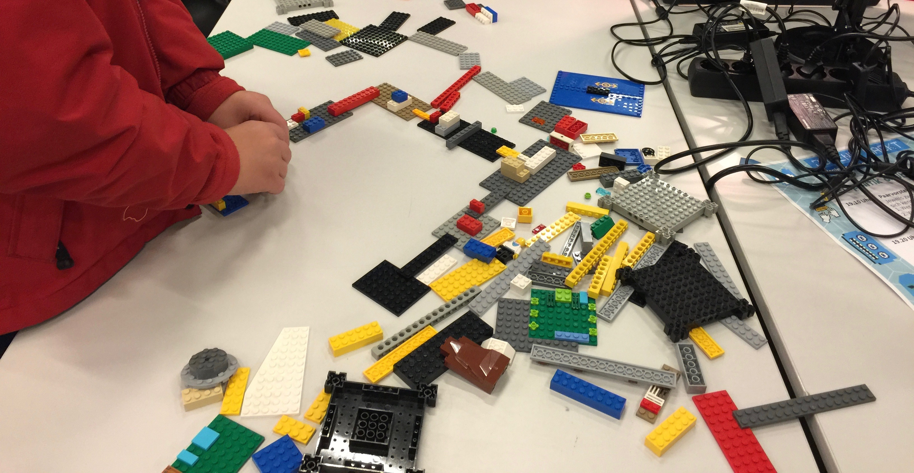

# Sound Island
> A game purely based on sound.

## Die Idee
Es gibt unendlich viele tolle Video-Spiele, allerdings sind diese nicht für alle zugänglich und barrierefrei! 
Sound Island ist ein Audio-Spiel, dass sehbehinderte Menschen nur durch Sound-Effekte, Musik und Eingabe-Geräte am Computer im Web-Browser spielen können.

## Das Setting

Ein Schiff beladen mit Maschinen-Teilen fährt in einer stürmischen Nacht auf eine Felsgruppe und zerschellt.
Fast alle können sich rechtzeitig in die Rettungsboote retten, nur die 9 Jahre alte Lanu ist unter Deck und bekommt nichts vom Unglück mit.
Durch die Wucht des Aufpralls wird sie in eine Felsspalte geschleudert und findet sich in einer dunklen, nassen Höhle wieder.
Die Heldin Lanu muss nun durch die Höhle wieder nach draußen...

## Der Prozess

Zuerst haben wir in der großen Gruppe (9 Personen) in einem gemeinsamen Dokument Ideen für das Spiel gesammelt.
Die Levels haben wir mit Lego modelliert, um auch den Prozess beim Erstellen der Spielwelt barrierefrei zu gestalten.
Platten stellen Räume und die Steine die Verbindungsgänge zwischen den Räumen dar.

## Die technische Umsetzung
Wir haben uns für dafür entschieden ein auf Web-Technologien basiertes Spiel zu entwickeln.
Als Programmiersprache benutzen wir p5.js und die mitgelieferten Plugins für Audio-Verarbeitung.
p5.js ist ein Wrapper für das Web Audio Framework. 
Die Levels werden von den realen Lego-Modellen auf eine virtuelle Tile Map (Tiled) übertragen, damit die Wände, Geräusche und Untergründe für die Verarbeitung im zur Verfügung stehen.

### Lizenz-Attribute

* River (License: Attribution 3.0) recorded by Caroline Ford
* Water Noise (License: Attribution 3.0) recorded by Caroline Ford 
* Water Fountain Noise (License: Attribution 3.0) recorded by Caroline Ford 
* Bats In Cave Sound (License: Attr-Noncommercial 3.0) recorded by Mike Koenig 
* Cave Bats Sound (License: Attr-Noncommercial 3.0) recorded by Mike Koenig 
* Machine Sound (License: Attribution 3.0) recorded by Marianne Gagnon 
* Crackling Fireplace Sound (License: Attribution 3.0) recorded by Daniel Simion 
* Bats Vocalizing Sound License: (Public Domain) recorded by fws.gov 
* Dark Cavern Soundscape Sound (License: Attribution 3.0) recorded by Mike Koenig 
* Glitter 1 recorded by Julius Fischer
* Glitter 2 recorded by Julius Fischer
* Glitter 3 recorded by Julius Fischer
* Walking on Gravel (License: Attribution 3.0) recorded by Caroline Ford 
* Footsteps On Cement Sound (License: Public Domain) recorded by Tim Fryer
* Sqeaking Door Sound (License: Attribution 3.0) recorded by Sarasprella 
* Monster (License: Attribution 3.0) recorded by cylon8472
